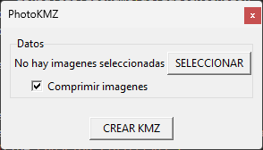
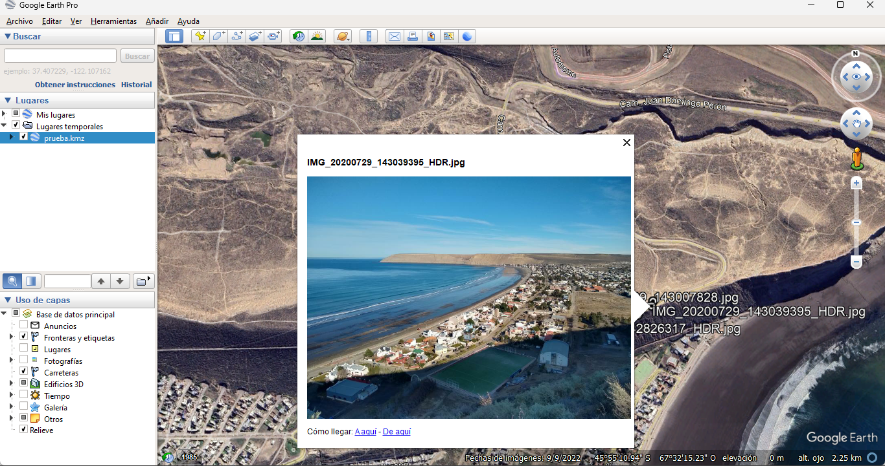

# PhotoKMZ
Herramienta gráfica para crear un archivo kmz a partir de imágenes con información gps.

## Características
- Se utiliza PIL para obtener las coordenadas a partir los metadatos exif de cada imagen.
- Se puede reducir y comprimir las imágenes para disminuir el tamaño del archivo kmz.
- Se utiliza SimpleKml para generar el archivo kmz.

## Instalación
### Utilizando python
- Clonar este repositorio.
- Instalar Python 3.9.7
- Instalar las dependencias utilizando: <pre><code>pip install -r requirements.txt
</code></pre>
- Ejecutar el script photokmz.py

### Binarios
- Para Windows utilizar
- Para Debian/Ubuntu 